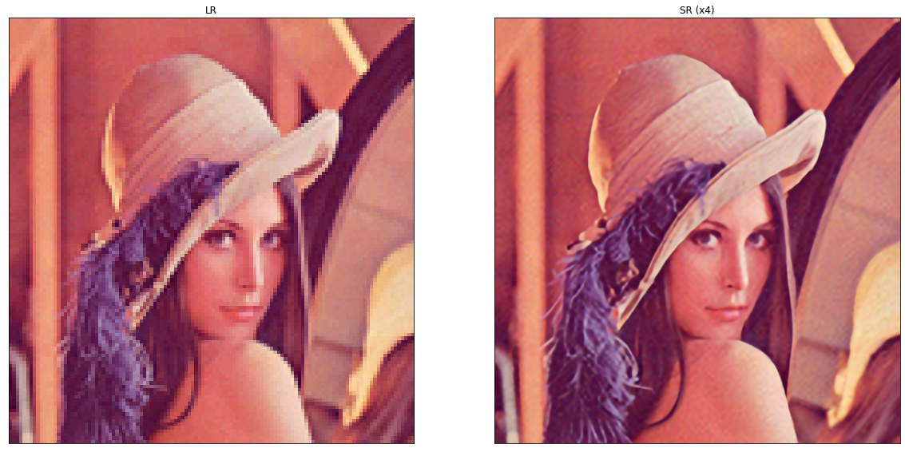
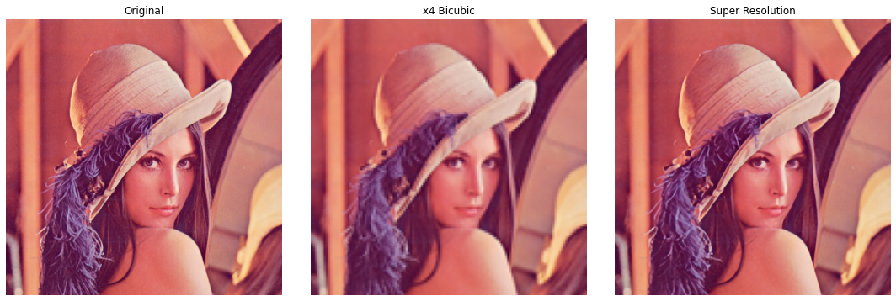

# Single Image Super-Resolution with EDSR, WDSR and ESRGAN

A Tensorflow 2.x based implementation of

- [Enhanced Deep Residual Networks for Single Image Super-Resolution](https://arxiv.org/abs/1707.02921) (EDSR), winner 
  of the [NTIRE 2017](http://www.vision.ee.ethz.ch/ntire17/) super-resolution challenge.

- [Enhanced Super Resolution Generative Adversarial Network (by Xintao Wang et.al.)](https://arxiv.org/pdf/1809.00219.pdf) (ESRGAN)

- [Wide Activation for Efficient and Accurate Image Super-Resolution](https://arxiv.org/abs/1808.08718) (WDSR), winner 
  of the [NTIRE 2018](http://www.vision.ee.ethz.ch/ntire18/) super-resolution challenge (realistic tracks). 

## Dataset used for training:
A `DIV2K` [data provider](#div2k-dataset) automatically downloads [DIV2K](https://data.vision.ee.ethz.ch/cvl/DIV2K/) 
training and validation images of given scale (2, 3, 4 or 8) and downgrade operator ("bicubic", "unknown", "mild" or 
"difficult"). 


## What is single image super resolution?

Single image super resolution aims to construct a high-resolution image (HR) from a low resolution image (LR). This is essentially done by upsampling the LR image to HR image. Deep learning models are utilized to perform this upsampling. Loss functions are used to measure reconstruction error and guide the model optimization. 

### Hardware Requirements

- It is preferable to have a GPU ( cuda support in Tensorflow 2.x) but it works otherwise too. 

## How to run the models?

Clone this repository or download the master branch as a zip file to your computer. 
Navigate to your downloaded directory and run the below commands: 

Step 1: Create a python virtual environment  
```
    python -m venv sr
    Scripts\activate 
``` 
Step 2: install the requirements in the environment 
```
    python -m pip install -r requirements.txt 
``` 

Step 3: Run ESRGAN (esrgan.ipynb) or EDSR (example-wdsr.ipynb) or WDSR (example-wdsr.ipynb)

Note: You can skip training the models and directly use the model weights. 

### Test with your own input images

In order to run with your own input, resize the input image to width: 124 and height 118 pixels. 
Store the input image inside the demo folder and run the following code cell:
```
resolve_and_plot('demo/<imgfile>')
```
## Results of EDSR



PSNR: 5.1907578
## Results of ESRGAN 



PSNR value: 29.865347


Source:

[ESRGAN](https://www.tensorflow.org/hub/tutorials/image_enhancing)
[EDSR](https://github.com/krasserm/super-resolution)
